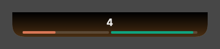
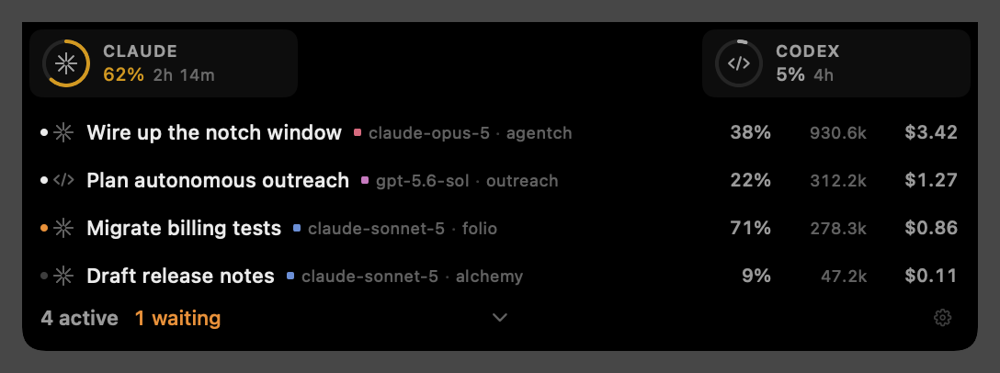
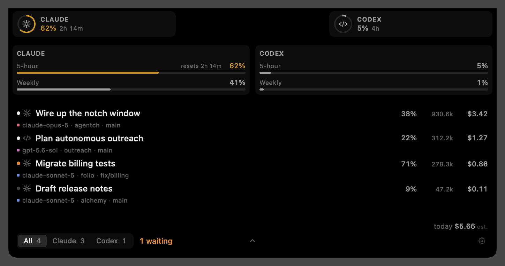

# agentch

A macOS notch app that tracks your AI coding agents. Hover the notch to see what Claude Code and
Codex are working on right now, what they have spent, and how close you are to your limits.

Everything is read-only. agentch never writes to, or refreshes, another tool's credentials.

## Screenshots

**Closed.** Ambient only. One segment per provider across the width of the notch, filled with what
is left of its nearest limit. The whole thing glows amber when a session is waiting on you. On a
notched display only the bottom sliver is visible, which is where the bar lives; on displays
without one you get the pill below.



**Hover.** A progress ring per provider parked in the dead space either side of the cutout, then
every active session, one line each. The count, the expand chevron and the gear share a bar along
the bottom. Clicking a session reopens it in the app that owns it.



**Click.** The full panel: the same rings in the same place, every limit window per provider with
reset countdowns, and the session feed with model, project, branch, context use, tokens and
estimated cost.



## What it does

**Sessions**

- Live feed of every running Claude Code and Codex session, newest first, across all your projects.
- Per session: title, model, project, git branch, context window used, tokens, and estimated cost.
- State per session — working, idle, waiting on you, done — as a coloured dot.
- Click any session to reopen it in the app that owns it.
- Filter the panel by provider, or show everything.

**Limits**

- Every rate-limit window each provider reports: 5-hour, weekly, and model-scoped weekly windows
  (Opus, Sonnet, Fable) where they exist.
- A reset countdown per window, and a colour that escalates as a window fills.
- Burn-rate projection: how long until a window fills at the rate you are currently going.
- Windows derived locally rather than reported by the server are labelled `est.` so you know the
  difference.

**Cost**

- Estimated dollars per session and for the day, at API list prices, always labelled as an
  estimate.
- A parity toggle for how tokens are counted: include cache tokens to match `ccusage` totals, or
  exclude them to match what the provider web apps show.

**Attention**

- Opt-in detection of sessions blocked on a permission prompt or a question, surfaced as an amber
  pulse on the closed notch and a count in the hover.

**Appearance**

- Per-display: show on the notched built-in, on external displays as a top-centre pill, or both.
- A colour per agent and per model. Models start on a colour derived from their name, so they are
  distinguishable before you pick anything.
- Choose which per-session details the hover carries, so it stays as dense or as sparse as you
  want.

Every stage change is instant — the panel and its content are simply there, with no animation to
sit through.

## Installing it

There is no signed or notarised build yet, so you build it from source. It takes about a minute.

**1. Check you are on macOS 14 or newer.**

```bash
sw_vers -productVersion
```

**2. Make sure you have a Swift 6 toolchain.**

```bash
swift --version
```

If that fails, install Apple's Command Line Tools and try again. Xcode works too, but is not
required — this project is SwiftPM-only and has no `.xcodeproj`.

```bash
xcode-select --install
```

**3. Clone the repository.**

```bash
git clone https://github.com/aktoriukas/agentch.git
cd agentch
```

**4. Build it.**

```bash
swift build -c release
```

**5. Build the app bundle and install it.**

```bash
./scripts/build-app.sh --install
open -a Agentch
```

That produces `Agentch.app`, icon and all, and copies it to `/Applications`. Drop `--install` to
leave it in `build/` instead. To run the bare executable without a bundle, `.build/release/Agentch`
works too — but launch-at-login needs the bundle.

Nothing appears in the Dock or the menu bar — that is deliberate, it runs as an agent app. Move
your pointer to the notch (or to the top centre of your display, if it has no notch) and the panel
appears.

**6. Grant Keychain access when macOS asks.**

The first time it fetches Claude limits, macOS prompts for access to the Keychain item Claude Code
stores its OAuth token in. Allow it and the limits come from Anthropic's usage endpoint; deny it
and agentch falls back to a local 5-hour estimate, labelled `est.` in the UI. Codex limits need
neither network nor auth — they are read straight out of its local rollout files.

**7. Optional: keep it running.**

Open the gear in the hover or the panel and turn on **Launch at login**.

**8. Optional: turn on "waiting on you" detection.**

Also in settings, under Claude Code. See below for exactly what it changes.

To update later, `git pull` and repeat step 4.

### Detecting sessions that are waiting on you

Off by default. Enabling it adds two hooks (`Notification` and `Stop`) to `~/.claude/settings.json`
that append events to a file agentch watches; turning it off removes exactly those entries. The
file is backed up to `settings.json.agentch-backup` before either edit.

## How it gets its data

- **Codex** — `~/.codex`: rollout files carry live rate-limit snapshots (no network, no auth), and
  the thread database supplies titles, models and per-thread token counts.
- **Claude Code** — `~/.claude`: a registry of running sessions, per-session todo lists, and
  transcripts with per-message token usage for cost. Subscription limits come from Anthropic's
  OAuth usage endpoint, falling back to a labelled local estimate when it is unavailable.

## Development

```bash
swift run Agentch --selfcheck   # assert-based checks for the pure logic in AgentchCore
swift run Agentch --render      # renders each stage to /tmp/agentch-*.png
swift run Agentch --dump        # prints what the providers currently report
swift run Agentch --icon        # renders the app icon to /tmp/agentch-icon.png
```

The icon is drawn in SwiftUI (`Sources/Agentch/AppIcon.swift`) rather than kept as a binary asset,
so `scripts/build-app.sh` renders it, downsamples it into an iconset and packs the `.icns` at build
time.

`--render` exists because this machine has Command Line Tools without Xcode: there are no previews,
and no XCTest or swift-testing either, so checks live in `AgentchCore/SelfCheck.swift`. The
screenshots above come straight out of it.

## Credits

Built fresh, but standing on MIT-licensed work worth reading:
[NotchDrop](https://github.com/Lakr233/NotchDrop) and
[DynamicNotchKit](https://github.com/MrKai77/DynamicNotchKit) for notch window mechanics,
[codex-island](https://github.com/ericjypark/codex-island) for notch-specific details,
[CodexBar](https://github.com/steipete/CodexBar) for provider endpoint and credential handling, and
[ccusage](https://github.com/ccusage/ccusage) for the cost-computation method.

MIT licensed.
